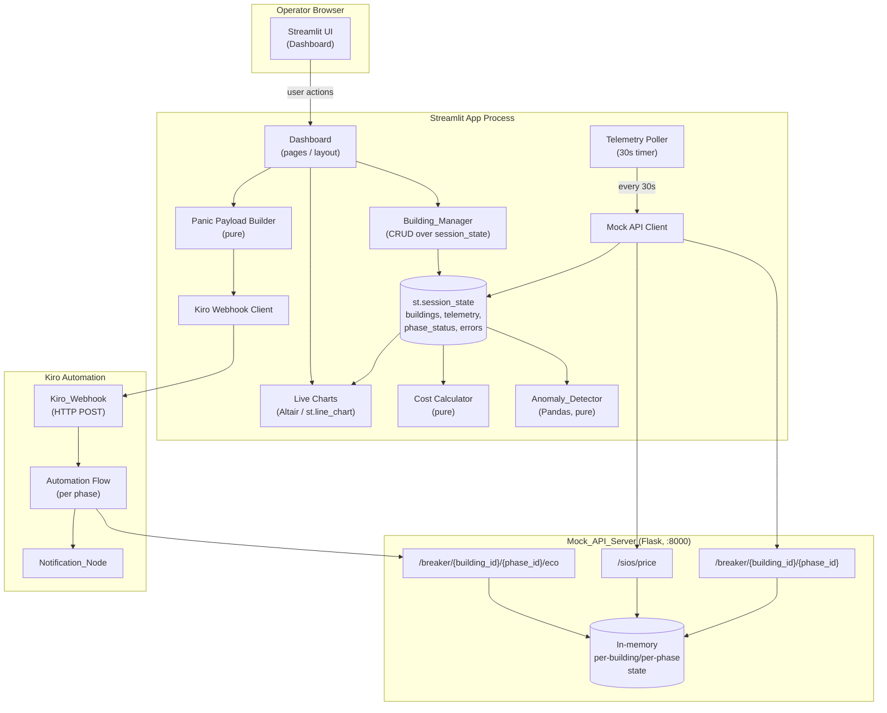
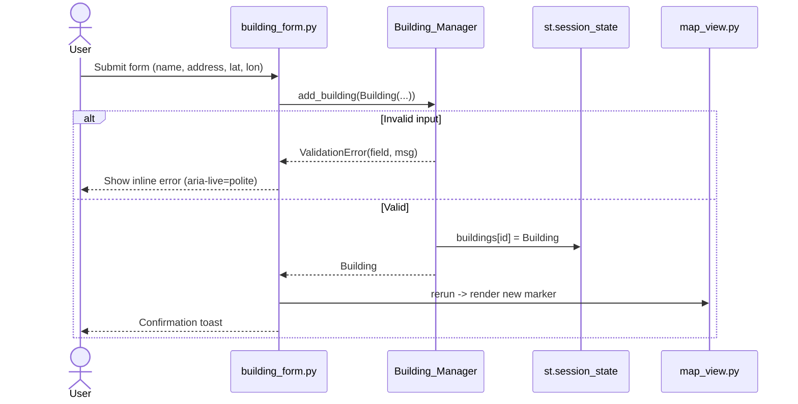
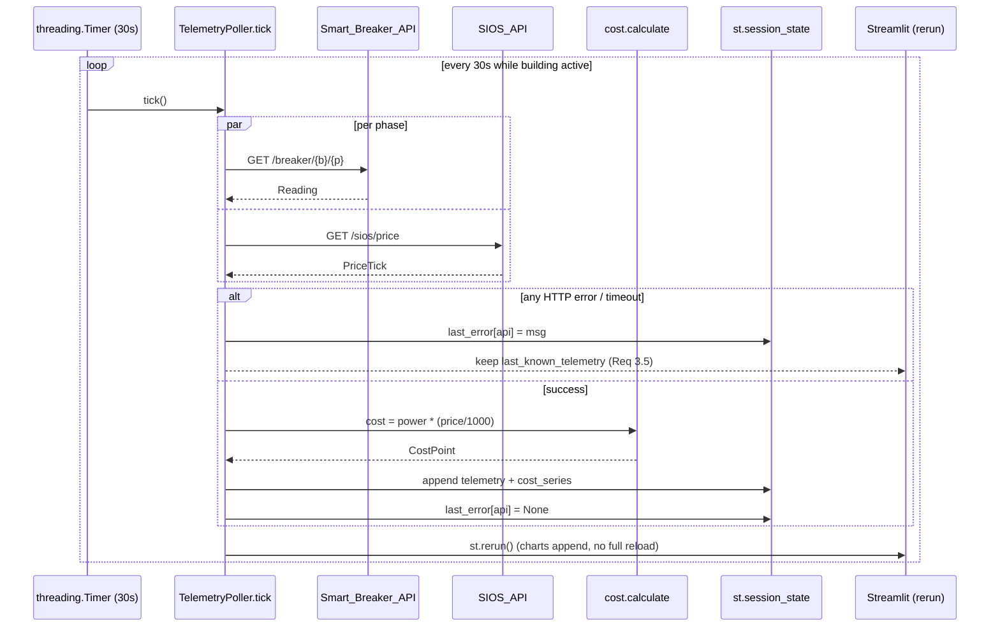

# Design Document

## Overview

Energy Hunter is a B2B Energy Management Dashboard MVP built as a single-page Streamlit application backed by a local Mock API Server. The system addresses three core operator needs:

1. **Geographic + structural management** of multiple buildings, each broken down into electrical phases and assets.
2. **Real-time monitoring** of per-phase telemetry and dynamic Spanish wholesale energy cost, with anomaly detection over historical Sunday consumption.
3. **Granular load reduction** via a Panic Button that fires a Kiro webhook for the selected phases only and reflects the resulting Eco Mode state in the UI.

The MVP is intentionally local-only and demo-grade: no external network dependencies, no real auth, in-memory state. The design therefore optimizes for clarity, testability, and a clean separation between *pure logic* (anomaly detection, expense calculation, payload building) and *I/O* (HTTP polling, webhook calls, Streamlit rendering). That separation is what makes property-based testing realistic in a Streamlit app.

### Key design decisions

| Decision | Rationale |
|---|---|
| Streamlit + `st.session_state` for persistence | Requirement 1.2 / 2.4 explicitly call for Session_State persistence; no DB needed for MVP. |
| Single Flask-based Mock API Server (vs. two servers) | Requirement 8.1 mandates a single local HTTP server exposing both Smart Breaker and SIOS endpoints. |
| Pure-function core (`anomaly_detector`, `cost_calculator`, `panic_payload_builder`) | Enables property-based testing under TDD without spinning up Streamlit or HTTP. |
| Background polling via a `threading.Timer` loop writing into `st.session_state` through `st.runtime.scriptrunner.add_script_run_ctx` + `st.experimental_rerun` (or `st.rerun`) | Requirement 3.1 (30s polling) and 7.3 (no full page reload) require an out-of-band update mechanism. |
| `st.map` for the Interactive Map, with a separate `pydeck` overlay layer for anomaly markers | `st.map` is the simplest fit for Requirement 1.4; `pydeck` (already a Streamlit dependency) gives us a distinct second marker style for Requirement 4.4. |
| Conventional Commits + TDD per workspace standards | Workspace `development-standards.md` is `inclusion: always`. |

### Streamlit + accessibility caveat (called out up-front)

Streamlit does not give first-class control over the rendered HTML/ARIA tree. The design follows WCAG 2.1 AA *to the extent Streamlit allows* (semantic widgets, labels, contrast, keyboard nav, focus order, status announcements via `st.status` / `aria-live` regions in a custom component). Where AA cannot be fully met by stock Streamlit (notably custom map markers and non-text contrast on tooltips), the design specifies a small custom `streamlit.components.v1` HTML component to fill the gap. Deviations are listed explicitly in the Accessibility section.

## Architecture

### High-level architecture



### Process & runtime model

- **Streamlit process** (`streamlit run app.py`): hosts the UI and a single background polling thread per session.
- **Mock API process** (`python -m energy_hunter.mock_api`): independent Flask server on `localhost:8000`. Started with one command (Requirement 8.5).
- **Kiro Webhook**: in the demo configuration, runs as a third local listener (`localhost:9000`) that *itself* posts to the Mock API's Eco Mode endpoint. In real deployments this would be Kiro Cloud; for the MVP we ship a tiny local stub so the loop closes end-to-end.

### Module layout

```
energy_hunter/
├── app.py                       # Streamlit entry point; assembles pages
├── ui/
│   ├── layout.py                # Responsive grid/flex layout helpers
│   ├── map_view.py              # Interactive_Map (st.map + pydeck anomalies)
│   ├── building_form.py         # Add/edit building + phases + assets
│   ├── panic_panel.py           # Panic_Button UI
│   ├── charts.py                # Live consumption + cost charts
│   └── a11y.py                  # ARIA-live status component (custom HTML)
├── core/
│   ├── models.py                # Dataclasses: Building, Phase, Asset, Reading
│   ├── building_manager.py      # CRUD over st.session_state
│   ├── anomaly_detector.py      # Pure Pandas rule engine
│   ├── cost.py                  # Expense = Power * (Price / 1000)
│   ├── panic.py                 # Build payload, validate selection
│   └── poller.py                # 30s polling loop
├── clients/
│   ├── breaker_client.py        # Smart_Breaker_API client
│   ├── sios_client.py           # SIOS_API client
│   └── kiro_client.py           # Kiro_Webhook client
├── mock_api/
│   ├── server.py                # Flask app: breaker + sios + eco endpoints
│   ├── state.py                 # Per-building/per-phase in-memory state
│   └── kiro_stub.py             # Local Kiro webhook stub (demo only)
└── data/
    └── historical.csv           # Historical_Dataset (with Sunday anomalies)
```

## Components and Interfaces

### Dashboard (`ui/*`, `app.py`)

Responsibilities:
- Render the responsive layout (sidebar = building list / form, main = map + telemetry + charts + panic panel).
- Read from `st.session_state` only — never owns mutation logic.
- Wire user actions to `Building_Manager`, `panic.build_payload`, and the polling lifecycle.

Public surface (functions called by `app.py`):
```python
def render_sidebar(state: AppState) -> None
def render_map(state: AppState) -> None
def render_telemetry(state: AppState, building_id: str) -> None
def render_charts(state: AppState, building_id: str) -> None
def render_panic_panel(state: AppState, building_id: str) -> None
```

### Building_Manager (`core/building_manager.py`)

Pure CRUD over a typed view of `st.session_state["buildings"]`. The session-state coupling is isolated behind a thin `SessionStore` protocol so unit tests inject a dict.

```python
class BuildingManager:
    def __init__(self, store: SessionStore): ...
    def add_building(self, b: Building) -> Building            # validates 1.1, 1.3
    def update_building(self, b: Building) -> Building
    def delete_building(self, building_id: str) -> None
    def list_buildings(self) -> list[Building]
    def get(self, building_id: str) -> Building | None
    def upsert_phase(self, building_id: str, p: Phase) -> Phase
    def set_phase_status(self, building_id: str, phase_id: str, status: PhaseStatus) -> None
```

Validation rules (Requirement 1.3):
- `name`: non-empty, trimmed, ≤ 120 chars.
- `address`: non-empty, trimmed.
- `latitude`: float in `[-90, 90]`.
- `longitude`: float in `[-180, 180]`.
Validation errors are raised as `ValidationError(field, message)` and surfaced by the form.

### Anomaly_Detector (`core/anomaly_detector.py`)

Pure function over a Pandas DataFrame. No I/O. No Streamlit.

```python
def detect_anomalies(df: pd.DataFrame, threshold: float = 1.40) -> pd.DataFrame:
    """
    Input columns: building_id, timestamp, consumption_kwh
    Output: input columns + `is_anomaly: bool` + `weekday_baseline_kwh: float`
    Rule: For each building, baseline = mean(consumption on Mon-Fri).
          A Sunday row is an anomaly iff consumption > threshold * baseline.
    """
```

Edge cases handled:
- Building with no weekday rows → no anomalies (baseline undefined).
- Building with weekday baseline of 0 → no anomalies (avoid div-by-zero, document choice).
- Empty DataFrame → empty DataFrame with the same schema.

### Mock_API_Server (`mock_api/server.py`)

Flask app exposing:

| Method | Path | Purpose | Requirement |
|---|---|---|---|
| `GET` | `/breaker/{building_id}/{phase_id}` | Per-phase telemetry: `active_power_kW`, `voltage_v`, `current_a`, `mode` | 3.1, 3.2, 8.1, 8.2 |
| `GET` | `/sios/price` | Current hourly price in EUR/MWh | 3.3, 8.1 |
| `POST` | `/breaker/{building_id}/{phase_id}/eco` | Switch a phase to `ECO_MODE` | 8.3, 8.4 |
| `GET` | `/healthz` | Liveness check | ops |

State (`mock_api/state.py`) is keyed by `(building_id, phase_id)`:
```python
@dataclass
class PhaseState:
    baseline_power_kw: float
    mode: Literal["NORMAL", "ECO_MODE"]
    last_reading_ts: datetime
```

Behavior on `GET /breaker/...`: returns `active_power_kW = baseline_power_kw * (0.6 if mode == "ECO_MODE" else 1.0)` plus small jitter (Requirement 8.4: 40% reduction). Buildings/phases unknown to the mock are *lazily provisioned* with deterministic baselines so the dashboard works without a separate registration step.

### Kiro_Webhook integration (`clients/kiro_client.py` + `mock_api/kiro_stub.py`)

Client side:
```python
def post_panic(payload: PanicPayload, *, timeout_s: float = 5.0) -> PanicResult:
    """POST JSON to KIRO_WEBHOOK_URL. Returns PanicResult(ok, status, error)."""
```

Stub side (demo Kiro automation):
1. Validate the payload schema (`building_id`, `selected_phases: list[str]`, `affected_assets: list[str]`).
2. For each phase in `selected_phases`, `POST /breaker/{building_id}/{phase}/eco` against the Mock API (Requirement 6.2 — only selected nodes).
3. Call `Notification_Node.dispatch(...)` (Requirement 6.3); failures are logged but never block the 2xx response (Requirement 6.4).
4. Return `200 OK` with a summary body.

### Telemetry Poller (`core/poller.py`)

```python
class TelemetryPoller:
    def __init__(self, interval_s: float = 30.0, clients: Clients, store: SessionStore): ...
    def start(self, building_id: str) -> None
    def stop(self) -> None
    def tick(self) -> None   # exposed for tests; deterministic
```

`tick()` performs one polling cycle: fetch breaker per phase, fetch SIOS price once, compute cost, append to the rolling `telemetry` deque in session state. The 30-second interval is enforced by a `threading.Timer`; tests drive `tick()` directly.

## Data Models

```python
from dataclasses import dataclass, field
from datetime import datetime
from typing import Literal

PhaseStatus = Literal["NORMAL", "ECO_MODE"]

@dataclass(frozen=True)
class Asset:
    id: str
    name: str

@dataclass
class Phase:
    id: str
    name: str                     # e.g., "Phase A"
    panic_enabled: bool           # Requirement 2.2
    assets: list[Asset] = field(default_factory=list)
    status: PhaseStatus = "NORMAL"

@dataclass
class Building:
    id: str
    name: str
    address: str
    latitude: float
    longitude: float
    phases: list[Phase] = field(default_factory=list)

@dataclass(frozen=True)
class Reading:
    building_id: str
    phase_id: str
    timestamp: datetime
    active_power_kw: float
    voltage_v: float
    current_a: float
    mode: PhaseStatus

@dataclass(frozen=True)
class PriceTick:
    timestamp: datetime
    eur_per_mwh: float

@dataclass(frozen=True)
class CostPoint:
    building_id: str
    timestamp: datetime
    consumption_kwh: float
    total_cost_eur: float
    is_anomaly: bool = False

@dataclass(frozen=True)
class PanicPayload:
    building_id: str
    selected_phases: list[str]
    affected_assets: list[str]

@dataclass(frozen=True)
class PanicResult:
    ok: bool
    status_code: int
    error: str | None = None
```

`st.session_state` shape:
```python
{
  "buildings": dict[str, Building],
  "active_building_id": str | None,
  "telemetry": dict[str, deque[Reading]],     # bounded, e.g., maxlen=720 (~6h at 30s)
  "cost_series": dict[str, deque[CostPoint]],
  "anomalies": dict[str, pd.DataFrame],
  "last_error": dict[str, str | None],        # per-API error indicator (Req 3.5)
  "last_known_telemetry": dict[str, Reading], # retained on error (Req 3.5)
}
```

## Interaction flows

### Add building



### 30-second polling cycle



### Panic flow + Eco Mode propagation

```mermaid
sequenceDiagram
    actor User
    participant UI as panic_panel.py
    participant PB as panic.build_payload
    participant KC as kiro_client
    participant KW as Kiro_Webhook (stub)
    participant Mock as Mock_API_Server
    participant Notif as Notification_Node
    participant State as st.session_state

    User->>UI: Click Panic; UI shows Panic-Enabled phases only (Req 5.1)
    User->>UI: Tick selected phases; Confirm (Req 5.2)
    UI->>PB: build_payload(building, selected_phase_ids)
    PB-->>UI: PanicPayload(building_id, selected_phases, affected_assets)
    UI->>KC: post_panic(payload, timeout=5s)
    KC->>KW: POST /kiro/panic
    alt HTTP 2xx
        KW->>Mock: POST /breaker/{b}/{p}/eco  (per selected phase, Req 6.2)
        Mock-->>KW: 200 OK
        KW->>Notif: dispatch(building_id, selected_phases, assets)
        Note over KW,Notif: Req 6.4: log on failure, do not block
        KW-->>KC: 200 OK
        KC-->>UI: PanicResult(ok=True)
        UI->>State: phases[*].status = ECO_MODE (Req 5.4)
        UI-->>User: aria-live announcement: "Eco Mode active on …"
    else non-2xx / timeout
        KC-->>UI: PanicResult(ok=False, error)
        UI-->>User: Error banner; phase statuses unchanged (Req 5.5)
    end
```

## Correctness Properties


*A property is a characteristic or behavior that should hold true across all valid executions of a system — essentially, a formal statement about what the system should do. Properties serve as the bridge between human-readable specifications and machine-verifiable correctness guarantees.*

The properties below are derived from the prework analysis and consolidated to eliminate redundancy. Each property targets pure logic so it can run hundreds of iterations cheaply; HTTP-bound properties are run against the in-process Flask test client (no real network).

### Property 1: Building round-trip persistence

*For any* `Building` with any number of `Phase`s (each with a `panic_enabled` flag and any list of `Asset`s), after `Building_Manager.add_building(b)` the call `Building_Manager.get(b.id)` returns a `Building` deeply equal to `b`, and `list_buildings()` contains exactly one element equal to `b` (assuming an empty store).

**Validates: Requirements 1.2, 2.1, 2.3, 2.4**

### Property 2: Validation predicate matches accept/reject

*For any* candidate input `(name, address, latitude, longitude)`, `validate_building_input(...)` raises `ValidationError` if and only if the input violates the documented validity predicate (non-empty/trimmed name and address; `latitude ∈ [-90, 90]`; `longitude ∈ [-180, 180]`); on rejection, `Building_Manager`'s store is unchanged.

**Validates: Requirements 1.3**

### Property 3: Map marker projections

*For any* list of `Building`s and any anomaly DataFrame, the regular marker frame produced by `build_marker_frame(buildings)` has length equal to `len(buildings)` and contains each building's `(id, latitude, longitude)`; and the anomaly marker frame produced by `build_anomaly_marker_frame(buildings, anomalies)` contains exactly the set of `building_id`s for which `anomalies` has at least one row with `is_anomaly == True`.

**Validates: Requirements 1.4, 4.4**

### Property 4: Sunday anomaly rule

*For any* historical DataFrame with columns `building_id`, `timestamp`, `consumption_kwh`, the result of `detect_anomalies(df, threshold=1.40)` satisfies, for every row `r`: `r.is_anomaly == (r.timestamp.dayofweek == 6) and (r.consumption_kwh > 1.40 * baseline[r.building_id])`, where `baseline[b]` is the mean of `consumption_kwh` over rows of building `b` whose `timestamp.dayofweek` is in `{0,1,2,3,4}`. Buildings with no weekday rows or a baseline of zero produce no anomalies.

**Validates: Requirements 4.1, 4.2**

### Property 5: Cost formula

*For any* non-negative `power_kw` and non-negative `price_eur_per_mwh`, `calculate_cost(power_kw, price_eur_per_mwh)` equals `power_kw * (price_eur_per_mwh / 1000)` within a documented floating-point tolerance.

**Validates: Requirements 3.4**

### Property 6: Telemetry tick semantics

*For any* prior session state and any sequence of breaker/SIOS responses (a mix of successful `Reading`s and simulated errors/timeouts), after applying the responses via `TelemetryPoller.tick()`:
- on a successful tick the latest entry of `telemetry[building_id]` equals the returned `Reading`,
- on a failed tick `last_known_telemetry[building_id]` is unchanged and `last_error[api]` is set,
- the length of `telemetry[building_id]` strictly grows by the number of successful ticks (append-not-replace), and the tail of length `k` equals the last `k` successful readings in order.

**Validates: Requirements 3.2, 3.5, 7.3**

### Property 7: Panic flow correctness

*For any* `Building` `b`, any subset `S` of `b`'s panic-enabled phase ids, and any simulated webhook response:
- `panic.build_payload(b, S)` returns a payload whose `building_id == b.id`, whose `selected_phases` is set-equal to `S`, and whose `affected_assets` equals the union of asset names across phases of `b` whose id is in `S`;
- on a 2xx response, the resulting building state has `phase.status == "ECO_MODE"` for every phase whose id is in `S` and unchanged status for every other phase, the Kiro stub issues exactly one Eco Mode call to the Mock API per phase id in `S` (no extras, no missing), and the Notification Node is dispatched once with content set-equal to the payload's three fields;
- on a non-2xx or timeout response, `b`'s phase statuses are deeply unchanged and an error is recorded;
- if the Notification Node dispatch itself fails, the webhook still returns 2xx, the Eco Mode calls are still issued, and a failure log entry is written.

**Validates: Requirements 5.3, 5.4, 5.5, 6.2, 6.3, 6.4**

### Property 8: Mock server state isolation and Eco reduction

*For any* sequence of operations (`read`, `set_eco`, `clear_eco`) targeting any set of `(building_id, phase_id)` keys, the observed state of any specific key `k` after the sequence depends only on operations targeting `k`. Furthermore, for any non-negative `baseline_power_kw`, after switching key `k` to `ECO_MODE`, a subsequent `GET /breaker/...` reports `active_power_kW` equal to `0.6 * baseline_power_kw` within the documented jitter tolerance.

**Validates: Requirements 8.2, 8.4**

### Property 9: Chart data filtering and anomaly styling

*For any* application state and any selected `building_id`, both `consumption_chart_data(state, building_id)` and `cost_chart_data(state, building_id)` contain only rows whose `building_id` matches the selection; and for any chart frame, `style_consumption(df)` assigns the distinct anomaly marker to row `i` if and only if `df.is_anomaly[i]` is `True`.

**Validates: Requirements 7.1, 7.2, 7.4**

### Property 10: Panic-enabled phase filter

*For any* `Building` `b`, `panic_choices(b)` is exactly `[p for p in b.phases if p.panic_enabled]`, in the same relative order as `b.phases`.

**Validates: Requirements 5.1**

## Error Handling

### Categories and policies

| Source | Failure modes | Policy | Requirement |
|---|---|---|---|
| Smart_Breaker_API | timeout, 5xx, malformed JSON, network down | retain `last_known_telemetry`, set `last_error["breaker"]`, render visible inline error indicator | 3.5 |
| SIOS_API | timeout, 5xx, malformed JSON | retain last known price, set `last_error["sios"]`, render inline error indicator | 3.5 |
| Kiro_Webhook (panic) | non-2xx, timeout, connection refused | leave phase statuses unchanged, render error banner with retry CTA | 5.5 |
| Kiro automation → Mock Eco endpoint | per-phase failure | continue with other phases (best-effort fan-out), surface partial-success summary | 6.2 |
| Notification_Node dispatch | failure | log, do **not** block phase update or webhook 2xx response | 6.4 |
| Building form validation | invalid name/address/lat/lon | reject submission, surface inline `aria-live="polite"` error message per field | 1.3 |
| Anomaly_Detector | empty DataFrame, missing baseline (zero/NaN) | return frame with `is_anomaly=False` for all rows; never raise | 4.1, 4.2 |
| Polling thread | unexpected exception | log full traceback, surface generic banner, restart polling on next interval | resilience |

### Resilience patterns

- **Bounded telemetry buffers**: each per-building deque has `maxlen=720` (~6 h at 30 s) to prevent unbounded memory growth.
- **Single-flight polling**: a `threading.Lock` ensures only one tick is in flight per building so a slow SIOS response cannot stack ticks.
- **Backoff on persistent errors**: after 3 consecutive failures of either API, the poller doubles the interval (cap 5 min) and resets on the next success.
- **Idempotent Eco Mode**: posting Eco Mode to a phase already in `ECO_MODE` returns 200 with no state change so retries are safe.
- **Payload schema validation** at both the client and the Kiro stub using `pydantic` (or `dataclasses` + manual validators if we keep dependencies minimal). Invalid panic payloads are rejected with HTTP 400 and a clear message.

### User-visible error surfaces

- Inline field errors next to form inputs (`role="alert"`, `aria-live="polite"`).
- A persistent "API status" pill in the header (green / amber / red) with `aria-live="polite"` so screen readers announce status changes once per change.
- A toast/banner for terminal Panic failures with a retry button.

## Testing Strategy

The project follows the workspace TDD standard: every behavior change starts with a failing test. The test pyramid below describes which test type owns which behavior, and the TDD cadence per component.

### Test layers

1. **Unit tests** (`pytest`) — pure functions and dataclass logic. Fast, no I/O.
2. **Property-based tests** (`hypothesis`) — one test per Correctness Property. Configured to ≥ 100 examples per property; deterministic seeds in CI.
3. **Integration tests** — Streamlit app + Mock API + Kiro stub, all in-process. Use Flask's `test_client` (no real sockets) for the Mock API and Kiro stub. Streamlit logic is exercised through `streamlit.testing.v1.AppTest` (the official Streamlit testing harness) where it gives meaningful coverage; pure logic is preferred.
4. **Smoke tests** — single-shot checks that the Mock API process starts and `/healthz` returns 200 (Requirement 8.5), and that `streamlit run app.py` boots without error.

### Property-based testing scope

PBT applies cleanly because most decision logic is pure: validation, the cost formula, the anomaly rule, the panic payload builder, the chart-data projector, and the Mock API state machine. PBT does **not** apply to:
- Streamlit's rendering loop or the Streamlit testing harness itself (use AppTest examples).
- The 30-second timer behavior (use a fake clock + example test).
- The exact look of map markers (visual concern).

Library: **Hypothesis**. Each property test:
- runs ≥ 100 generated examples (`@settings(max_examples=100)`),
- carries a comment in the form `# Feature: energy-hunter-dashboard, Property N: <property text>`,
- uses dedicated `st.composite` strategies for `Building`, `Phase`, `Asset`, `Reading`, and historical DataFrames,
- shrinks deterministically via `derandomize=True` in CI for reproducible failures.

### Component-level TDD plan

| Component | First failing test | Then implement |
|---|---|---|
| `core/models.py` | Pickling/equality unit tests for `Building`, `Phase`, `Asset` | Dataclass definitions |
| `core/building_manager.py` | Property 1 (round-trip) and Property 2 (validation) | `add_building`, `get`, validation rules |
| `core/anomaly_detector.py` | Property 4 with hand-built baseline frames | Pandas `groupby` rule engine |
| `core/cost.py` | Property 5 (formula) | One-line function |
| `core/panic.py` | Property 7 payload half + Property 10 | `build_payload`, `panic_choices`, `apply_panic_*` |
| `core/poller.py` | Property 6 with fake clients + 3.1 example with fake clock | `tick`, `start`, `stop` |
| `clients/*` | Integration test: client → Flask test client returns expected `Reading` / `PriceTick` | HTTP wrappers |
| `mock_api/server.py` | Property 8 (isolation + 40% reduction) and 8.1/8.5 smoke tests | Endpoints + `state.py` |
| `mock_api/kiro_stub.py` | Property 7 webhook half (fan-out + dispatch + 6.4 logging) | Stub endpoint |
| `ui/charts.py` | Property 9 over `consumption_chart_data` and `style_consumption` | Chart-data builder + Altair config |
| `ui/map_view.py` | Property 3 (marker frames) | Marker dataframe builders |
| `ui/building_form.py` | AppTest example: submit valid form → building appears; submit invalid → error visible | Form widget wiring |
| `ui/panic_panel.py` | AppTest example: only panic-enabled phases shown (5.1), confirm flips status on 2xx (5.4), failure leaves status (5.5) | Panic panel wiring |

### Integration scenarios (end-to-end, in-process)

1. **Add → poll → chart**: register a building, advance the fake clock by 30 s, assert telemetry and cost charts update with appended points.
2. **Anomaly highlighting**: load fixture historical CSV with crafted Sunday spikes, assert anomaly marker appears on map and rows are highlighted in the table.
3. **Granular panic**: configure a building with three phases (two Panic-Enabled), trigger panic on one of them, assert exactly that phase flips to `ECO_MODE`, the Mock API reports a 40% reduction on the next tick for that phase only, and the Notification Node was dispatched once with the correct payload.
4. **Resilience**: simulate Mock API 500 → assert `last_error["breaker"]` is set and `last_known_telemetry` is preserved; clear the error → assert the indicator returns to green within one tick.

### CI gates

- All unit + property tests must pass; no skipped property tests.
- Linting (`ruff`) and type-checking (`mypy --strict` over `core/` and `clients/`).
- Coverage threshold ≥ 90% on `core/` and `clients/`; the UI layer is exempted because it is largely framework wiring.
- Conventional Commits enforced via commit-msg hook (workspace standard).

## Responsive Layout Notes

Streamlit's default layout is responsive at the container level but exposes limited primitives. The design uses these levers:

- `st.set_page_config(layout="wide")` for desktop and large tablet.
- `st.columns([2, 5, 3])` to compose a sidebar / map / telemetry layout that collapses gracefully on narrow widths (Streamlit stacks columns vertically below ~640 px by default).
- A small custom CSS block injected via `st.markdown(..., unsafe_allow_html=True)` providing breakpoint rules:
  - Mobile (< 640 px): single-column stack; map height 240 px; charts use `use_container_width=True`.
  - Tablet (640–1024 px): two-column layout (sidebar collapses behind a Streamlit expander).
  - Desktop (> 1024 px): three-column wide layout as above.
- All charts pass `use_container_width=True` so they reflow with the parent column.
- The Interactive_Map uses `st.map` which already adapts to its container; for the pydeck overlay we set `height=None` so it inherits the column height.

These are the realistic responsive levers in Streamlit; we do not target finer breakpoints because Streamlit re-runs the script on resize and finer control would require ejecting to a custom component.

## Accessibility (WCAG 2.1 AA)

Streamlit is *not* fully WCAG-compliant out of the box. The design targets WCAG 2.1 AA where Streamlit allows and documents the gaps clearly.

### What we do (feasible in stock Streamlit)

- **Semantic widgets**: use `st.text_input`, `st.number_input`, `st.checkbox`, `st.multiselect`, `st.button` — each renders proper `<label>` ↔ `<input>` associations. Every widget is given a non-empty, descriptive `label` (no `label_visibility="collapsed"` without an `aria-label` fallback).
- **Headings hierarchy**: use `st.header` / `st.subheader` so the rendered DOM has an ordered `h1 → h2 → h3` hierarchy.
- **Color contrast**: pick a custom theme in `.streamlit/config.toml` whose foreground/background pairs and chart palette meet 4.5:1 for text and 3:1 for non-text UI/chart elements; the anomaly marker uses both color **and** shape so it is not color-only (1.4.1).
- **Keyboard navigation**: tab order follows DOM order; no custom focus traps; the Panic confirmation step is reachable via Tab → Space/Enter; `st.button(..., type="primary")` for the Confirm action so it is visually and structurally distinct.
- **Status messages**: surface API/panic status via `st.status` and a small custom `aria-live="polite"` region (a `streamlit.components.v1.html` component) so screen readers announce changes without stealing focus (4.1.3).
- **Form errors**: rendered with `role="alert"` next to the offending field (3.3.1, 3.3.3).
- **Reduced motion**: chart animations are disabled (`altair` `transition=alt.Transition(duration=0)`).
- **Focus visibility**: rely on Streamlit's default visible focus ring; do not override it in custom CSS (2.4.7).

### Custom component (a11y gap-filler)

A small `streamlit.components.v1` HTML component (`ui/a11y.py`) renders an `aria-live="polite"` region used for:
- API status changes ("Smart Breaker API is responding again").
- Panic confirmations ("Eco Mode active on Phase A and Phase C").
- Anomaly detection results ("3 anomalies detected for Building X").

This is the minimum custom component needed to meet 4.1.3 reliably.

### Known deviations / limitations

- **`st.map` markers** do not expose ARIA labels for individual points; we mitigate by listing the same buildings in a textual, keyboard-navigable list adjacent to the map (1.1.1, 2.1.1).
- **`pydeck` overlay** for anomaly markers is canvas-based and not screen-reader-accessible; the textual anomaly summary is the accessible alternative.
- **Chart tooltips** in Altair/Streamlit are mouse-driven; the same data is exposed via the underlying table beneath the chart for keyboard users (1.4.1, 2.1.1).
- **Reflow at 320 CSS px** (1.4.10): Streamlit stacks columns at narrow widths but some default paddings cause horizontal overflow on very small viewports; we ship a CSS override to enforce `max-width: 100vw; overflow-x: hidden` on the main container.

These deviations are accepted MVP trade-offs; they are recorded so a follow-up spec can address them with a heavier custom-component investment.

### Verification

- Automated: `axe-core` run via Playwright against the running Streamlit app for `serious` and `critical` violations; CI fails on either severity.
- Manual: keyboard-only walkthrough of the add-building, polling, and panic flows; VoiceOver / NVDA spot-check on the same flows.

## Open questions

1. Does the Kiro automation in production accept JSON over plain HTTP POST, or do we need HMAC signing for the MVP? (Currently designed without signing.)
2. Should the Mock API persist state across restarts (e.g., to a JSON file) for demo continuity, or is in-memory acceptable? (Currently in-memory.)
3. Confirm the historical dataset's expected schema (`building_id, timestamp, consumption_kwh`) — the design assumes this, and the data file under `data/historical.csv` will follow it.
